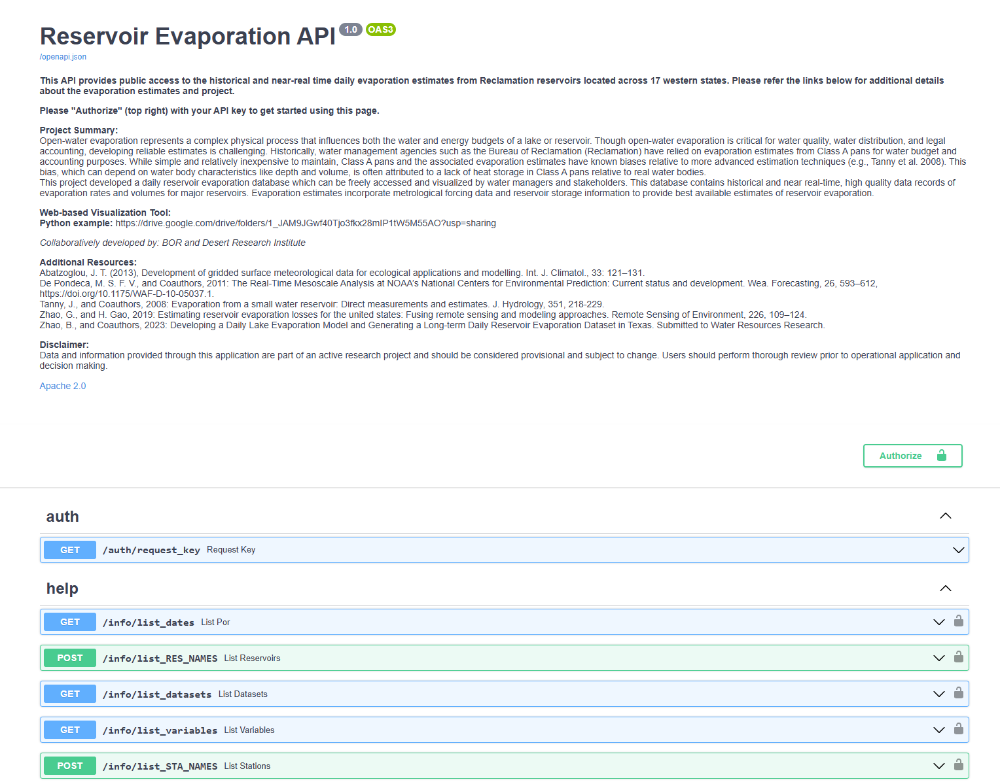

# Frequently Asked Questions

## How can I access the data?

There are three ways to access the data:

1. The web application for data visualization
   [https://dri-apps.earthengine.app/view/bor-reservoir-evaporation](https://dri-apps.earthengine.app/view/bor-reservoir-evaporation)

2. The API Playground for data inspection
   [https://operevap.dri.edu](https://operevap.dri.edu)

## How do I cite this dataset?

### Data citation:

Beta Status: This website is currently under development and may have some limitations or issues. Evaporation data should be considered provisional and not used for operational support or decision making. A production version of this API and database is scheduled to launch late summer 2025.

### Related DLEM Scientific Publications:

Zhao, G., & Gao, H. (2019). Estimating reservoir evaporation losses for the United States: Fusing remote sensing and modeling approaches. *Remote Sensing of Environment*, *226*, 109-124.

Zhao, B., Huntington, J., Pearson, C., Zhao, G., Ott, T., Zhu, J., ... & Gao, H. (2024). Developing a general Daily Lake Evaporation Model and demonstrating its application in the state of Texas. *Water Resources Research*, *60*(3), e2023WR036181.

## How often is data updated?

The reservoir evaporation database is updated daily; however, the gridded weather forcing data is produced with a 2-day latency leading to a 3-day lag between today and current estimates. We are currently exploring alternative weather datasets to reduce the lag in evaporation estimates.

## My dataset shows negative evaporation rates?

Negative evaporation (or condensation) occurs when the temperature of the water body falls below the dew point of the air above (cold water; moist air). Many models neglect to capture this process, but at certain reservoirs during certain time periods, condensation can account for a substantial portion of a reservoir's water balance. DLEM showed good agreement with negative evaporation estimates from Eddy Covariance at Lake Limestone, TX and other locations.

## Data I downloaded previously changed?

The input weather dataset used by DLEM provides provisional estimates for ~2 months to allow for review and updates. The reservoir evaporation database updates the last 2-months of data each day to incorporate changes in the forcing data and gather in-situ data that may not have been available during the initial model run. **Early, Provisional, and Final** **data flags are included with each daily estimate for tracking.**

## My reservoir shows static values for area, elevation, and volume?

Area, elevation, and volume information is not available in real-time for all reservoirs. For static locations, we assume area, depth, and volume based on conditions at full storage. If you have area, elevation, and volume information you'd like incorporated, please contact our team.

## Reservoir area, elevation, and volume values disagree with internal or operational estimates from my agency?

Reservoir AEV information is collated from numerous online databases and resources (see sources documentation here). In many cases, reservoir Area-Elevation-Volume information is updated based and updated bathymetric survey data that may not align with historical estimates. For consistency amongst each evaporation timeseries, the XXXX workflow uses elevation combined with the latest available AEV curves to estimate volume and area. Stakeholders should use the best available judgement when applying estimates and may choose to overwrite area, elevation, and volume information as needed.

!!! note
    Depths greater than 20 m are treated the same within the DLEM heat storage routine; however, depths less than 20 meters are considered and will influence evaporation estimates.

## How can I obtain an API key?

1. Go to [https://operevap.dri.edu](https://operevap.dri.edu)
2. Click the down arrow by auth/request_key
3. Click on "Try it out"
4. Fill out the form
5. Click 'Execute'
6. Your API key will be issued within 24 hours via email

## What do the data flags mean?

If you run a data request with the option `also_return=qflag`, you will see a qflag property in the return. This property is data quality flag:

- O: raw data value from data sites
- M: data was not available for this date and is filled with previous date data value
- S: data point is static
- R: removed outlier data
