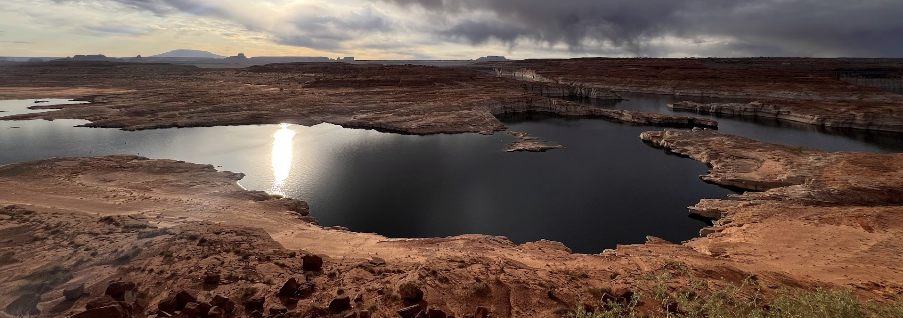
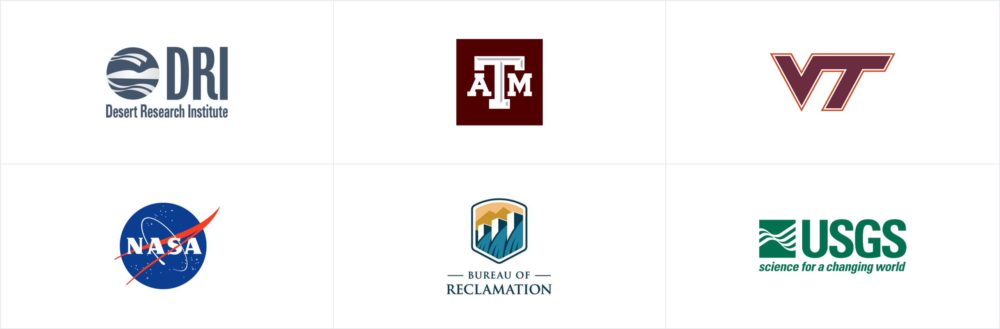

# Open Water Evaporation Network

{ width="800" }

## Beta status

OWEN is under active development, and its evaporation estimates should be
considered research-level products. Users should review the data, methods, and
their suitability for the intended application before integrating estimates into
operational decision-making or water-accounting workflows.

## Overview

The Open Water Evaporation Network (OWEN) provides access to open-water
evaporation estimates generated with the **Daily Lake Evaporation Model (DLEM)**.
OWEN supports water-resource monitoring, planning, research, and the development
of operational workflows for reservoirs and other water bodies.

OWEN is collaboratively developed by researchers and partners at the Desert
Research Institute (DRI), Texas A&M University (TAMU), Virginia Tech University (VTech), the Bureau of
Reclamation (Reclamation), National Aeronautics and Space Administration (NASA), and the U.S. Geological Survey (USGS).

## Access OWEN datasets

OWEN datasets vary in geographic coverage, meteorological inputs, reservoir
parameters, update frequency, and intended application. All datasets use DLEM
to estimate evaporation.

| Dataset                                                                             | Coverage and purpose | Status |
|-------------------------------------------------------------------------------------| --- | --- |
| [Texas database](https://docs.openwaterevap.net/databases/twdb_db/)                 | Texas water bodies | Available |
| [Reclamation database](https://docs.openwaterevap.net/databases/usbr_db/) | Reclamation water bodies | Available |
| CONUS database                                                                      | More than 44,000 water bodies across the conterminous United States | Planned for 2026 |

## Evaporation Databases

OWEN provides both general and agency-specific datasets to support a wide range of operational, planning, and research use cases. The datasets are designed to support specific user needs, including access to near-real-time evaporation estimates, continuity across historical and current conditions, and forecasting applications.

All OWEN datasets use the DLEM model to generate evaporation estimates. They differ in their meteorological forcing data, reservoir parameter information, geographic coverage, update frequency, and intended operational use. Together, these datasets provide flexible options for users who need consistent evaporation information for monitoring, water-management decisions, long-term analysis, and forward-looking planning.

## About evaporation estimation

Open-water evaporation is a complex physical process affecting the water and
energy budgets of lakes and reservoirs. Reliable estimates are important for
water quality, water distribution, reservoir operations, and water accounting.

Historically, many water-management agencies, including Reclamation, have used Class A
evaporation pans or static free water surface evaporation maps for water-budget and accounting
applications. Although pans are relatively simple and inexpensive to maintain,
their measurements can differ from evaporation from a lake or reservoir.
One important reason is that Class A pans do not represent the heat storage of
larger water bodies; the magnitude of this difference can vary with water-body
characteristics such as depth and volume.

## Collaboration

OWEN is developed in collaboration with the Reclamation, DRI, TAMU, VTech, NASA, and the USGS.

{ width="800" }

## Disclaimer

OWEN data and information are part of an active research effort and may change
as methods, inputs, and quality-control procedures evolve. Users are responsible
for evaluating the data’s suitability before using it in planning, operational,
or decision-making contexts.

## Funding and support

This project is funded by the Bureau of Reclamation Research and Development
Office (R20AC00008) and the NASA Water Resources Program (80NSSC22K0933).
Additional support is provided by the U.S. Geological Survey, U.S. Army Corps
of Engineers, Texas Water Development Board, and Oregon Water Resources
Department.

## References

- Abatzoglou, J. T. (2013). Development of gridded surface meteorological data
  for ecological applications and modelling. *International Journal of
  Climatology, 33*, 121–131.
- De Pondeca, M. S. F., et al. (2011). The Real-Time Mesoscale Analysis at
  NOAA’s National Centers for Environmental Prediction: Current status and
  development. *Weather and Forecasting, 26*, 593–612.
  <https://doi.org/10.1175/WAF-D-10-05037.1>
- Tanny, J., et al. (2008). Evaporation from a small water reservoir: Direct
  measurements and estimates. *Journal of Hydrology, 351*, 218–229.
- Zhao, G., & Gao, H. (2019). Estimating reservoir evaporation losses for the
  United States: Fusing remote sensing and modeling approaches. *Remote Sensing
  of Environment, 226*, 109–124.
- Zhao, B., Huntington, J., Pearson, C., Zhao, G., Ott, T., Zhu, J., et al.
  (2024). Developing a general Daily Lake Evaporation Model and demonstrating
  its application in the state of Texas. *Water Resources Research, 60*(3),
  e2023WR036181.
